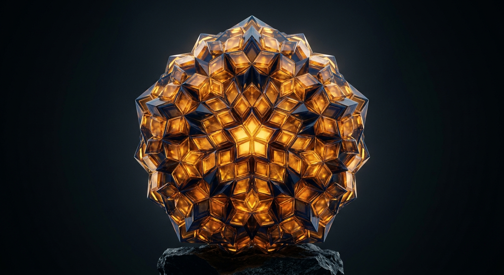
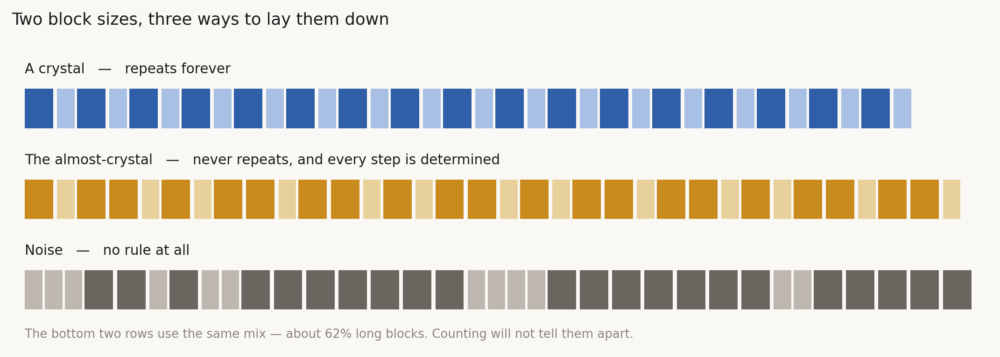
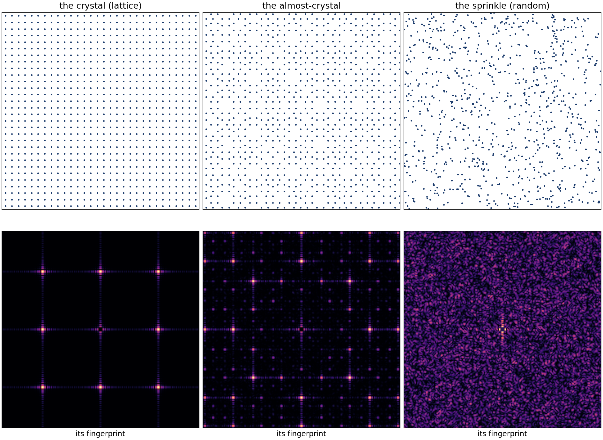

# The Almost-Crystal

*Quest for Entropy #10: the most beautiful in-between thing in physics auditioned for two jobs in my toy universe — and failed both, for the same reason. It cannot hide.*

## The question

The whole quest is one question. Could a plain deterministic world — clockwork, no dice — produce the probability wave that quantum mechanics runs on?

Whatever that clockwork is, I know what it has to sound like. It has to hold clean, steady tones, because the wave is built out of steady tones. And it must never repeat, because a pattern that comes back around is a loop, not a world.

That pair is nearly a contradiction. Chaos holds no tones — it smears everything it touches (episode #7). Repetition holds tones but loops (episode #8). I need order without repetition.

In 1982 Dan Shechtman put a metal alloy in an electron microscope and saw exactly that. A pattern of sharp, ordered spots, with a symmetry no repeating crystal is allowed to have. Order was on the screen, plain as day, and repetition was provably impossible. He was told to go and read a textbook. Linus Pauling said there were no quasicrystals, only "quasi-scientists". Shechtman was right, and in 2011 he got the Nobel Prize for it.

That is the picture at the top. It is my inspiration, not my experiment — what I built is its humblest relative, and I will keep the two apart.

Here is the idea with no mathematics in it. Take a long block and a short block, and grow a row by a rule: every long becomes long-short, every short becomes long. Start with one long block and turn the handle.

> L → LS → LSL → LSLLS → LSLLSLSL → …

That row never repeats. Not "not for a while" — never, at any length. And nothing in it is a choice; a child could extend it with a pencil. Yet it is secretly the same thing as walking around a circle in steps that never land back where they started — and walking a circle gives perfectly clean tones.

Order without repetition. Both boxes ticked, by real matter. That is why this candidate got more rounds than anything else in the quest — thirty-one of them.

## The run: the first audition

I refused to test it as letters on a screen. Letters are cheap. So: a chain of a hundred-odd weights joined by springs, the springs in two strengths, stiff and soft. Boring Newtonian physics you could build out of hardware. And every chain I test is made of the *same parts* — same weights, same two spring types, same count of each. The only thing that ever changes is the **order** the springs are laid in: the long-short rule, a plain repeat, or coin flips.

Then the question that matters for the whole project: what can a small observer *inside* that chain work out about it — no blueprint, no view of the ends, not even knowing its own address?

Here is the picture I keep in my head for this.

You are inside a very large bell, in the dark. Somebody strikes it. You cannot see a thing, but you can hear the ringing, and from the ringing you can work out the bell's pitch. That pitch is a property of the **whole bell** — its size, its shape, its thickness, all at once — and you get it wherever you happen to be standing, because the whole bell rings it everywhere.

So from one spot, in the dark, you have learned something true about the entire object. That much worked in my chain, and it worked well: listen at one point for a while, and you can pull out the chain's tune and predict what that spot will do next. A real thing to be able to do from inside.

But here is the sting. **A completely different bell can ring at the same pitch.** You can hear the tune; you can never hear the shape. I proved this to myself the hard way — by building a fake chain with the same tune and no deep order in it, and watching my best detectors treat the two as identical. Twice, with two different detectors, built two different ways.

And there is a reason it had to go like that, and it is in the mathematics literature, not in my code. What this chain rings at is neither clean separate notes nor a smooth band of sound. It is something in between — and in between not just once, but *at every zoom level at once*. A small observer resolves ambiguity by changing scale: look closer, listen longer. Against a thing that looks the same at every zoom, that move buys nothing. There is no scale at which the almost-crystal stops looking half like order and half like noise.

The property that made it the perfect candidate — sitting exactly between — is the property that makes it unreadable from inside. You can hear the tune. The tune is real, global, and honest. It is just not a blueprint, and it never will be.

First audition: failed. The full forensic story — both detectors, both collapses, and the numbers — ships in this episode's repository, for anyone who wants to watch it happen.

## The second audition: the floor

While writing this post-mortem, I realized there was a second job the almost-crystal could apply for, and I had never interviewed it properly.

Forget being the wave's engine. Could it be the **stage**? If the world is discrete deep down — if space itself has a grain — the grain has to be laid out somehow. A repeating lattice is the obvious way. An almost-crystal is the beautiful way. Coin flips are the ugly way. Which one could be a floor for a universe?

There is one hard rule for that job, and physics has been enforcing it for a century and a half: **a floor must not hand anyone a compass.** No experiment has ever found an absolute direction in space, or an absolute standstill. Whatever the grain is, it must keep its own alignments secret.

And there is a beautiful, ready-made instrument for checking exactly that — the very one from Shechtman's lab. Shine waves through a material, and the spots they make are the material's fingerprint: every sharp spot is a built-in direction, a built-in spacing, announced to anyone who looks.

So I laid the same grain down three ways and took each one's fingerprint.

The lattice, no surprise: spots on a neat grid. A compass and a meter stick, built into the floor. Disqualified.

The random sprinkle: a featureless haze. No spot, no direction, no scale. Nothing for a moving observer to catch hold of. It hides.

And the almost-crystal — sharp spots. *Razor* sharp, arranged with that impossible symmetry, exactly as the textbooks now promise. It never repeats, and it still cannot keep a secret.

Look at what just happened. **The photograph that won the Nobel Prize is the disqualification.** The sharp spots that proved quasicrystals were real order — order without repetition — are precisely the fingerprint a world's floor is not allowed to have. The discovery and the rejection are the same picture.

I ran one more check, a nastier one, counting the grain along the paths a traveler would take through each floor — the discrete version of carrying a clock. The lattice cheats a moving traveler by a fixed amount. The almost-crystal cheats by *the same amount, digit for digit*. The sprinkle deals fair. The numbers are in the repository; the sentence they add up to is short:

> **Aperiodicity is not randomness. Never repeating is not hiding.**

There is even an everyday version of the verdict. Film photography has grain — silver crystals scattered wherever they happened to land. A digital sensor has pixels — a lattice. Film's grain never shows you an alignment, because it has none. If nature has a grain, it is the film kind, not the pixel kind.

## What survives

The almost-crystal lost both jobs. But go back to what it secretly was: walking around a circle in steps that never land back home.

Readers of episode #2 have met that walk before. It is the machine — the clockwork that finally did produce quantum-shaped statistics runs on exactly those never-landing circle walks, many of them at once. The almost-crystal's *soul* was hired; only its body was turned away. Laid out in space, its perfection shows and betrays it. Running in time, as a rhythm, that same perfection is the whole engine.

It is not the floor. It is the beat.

## The Confession

My cleanest-looking scorecard was my weakest: the detector's early results looked perfect partly because I was scoring the chain against a tune taken from that same chain — it recognised its own photograph, and I read that as a pass. The self-matching that eventually killed the whole route was sitting in the first table I was pleased with; the rest of this episode's mistakes, including a wrong cause of death in my own notes, are in the public ledger with the old wording kept beside them.

## What this does NOT claim

- Nothing here is a claim about real quasicrystals as materials. My experiments ran on simulated one-dimensional chains and point sets; Shechtman's alloys are three-dimensional, and the five-fold pattern in the hero picture belongs to them, not to anything I measured.
- The floor test used the simplest almost-crystal constructions. The famous higher-symmetry tilings should fail the same way for the same reason — sharp spots are sharp spots — but that is expectation, not measurement.
- The random sprinkle passing is not my result. That randomly scattered points hide their own frame is an old and lovely theorem of the causal-set programme; my toy just watched it come true.
- No claim that nature *has* a grain. The claim is conditional: if there is one, it cannot be a lattice, and it cannot be an almost-crystal, for the same measurable reason.
- And not a claim that quasiperiodic order can never serve any substrate role — one family of readouts hit one named obstruction. Its time-side job in episode #2's machine is doing fine.

## The neighbors

**Dan Shechtman's** 1982 observation and 2011 Nobel are why any of this is physics; **Penrose tilings** are the celebrated two-dimensional cousins. The long-short row is a **Sturmian sequence**, classically equivalent to irrational circle rotations. The everything-in-between spectral character of the physical chain is **Sütő's** 1989 theorem and the literature around it. **Anderson localization** is the effect I mislabeled my failure with; the model where that genuinely happens in one dimension is **Aubry–André/Harper**, and that distinction is the content of my correction. The no-absolute-standstill rule descends from **Michelson and Morley**. And the fact that a random sprinkle of points singles out no direction and no frame is due to **Bombelli, Henson and Sorkin** in the causal-set programme — the one positive result in this episode, and it is theirs, not mine.

## Run it yourself

One repository: **quest-for-entropy-the-almost-crystal**. One command builds the chain from the rule, taps it, runs the bell readout, and then re-runs the whole crime scene: both collapsing detectors with their fakes, the three-floors fingerprint gallery, and the traveler's grain-count with every number this article deliberately left out. If a claim here does not match what your terminal prints, the article is wrong and I will correct it in public.

## How this was made

I am a software architect who does this as a hobby, not a physicist, and I say so every time. I set the questions and make the calls; the AI builds the engines, runs the measurements, argues with me about interpretations, and writes alongside me — the models on this episode were Fable 5, Opus 5 and Sonnet 5. The project keeps a public honesty ledger of its own mistakes, and the house rule stands: the article claims nothing its companion repository cannot re-run from scratch. The oldest experiments here predate that discipline, which is how a wrong cause of death survived in my notes until this write-up.

## Next time

Two auditions, two failures — and one constant I never questioned in either of them.

Both times, something happened, and I stood outside and *looked* at it. The detector that passed everything was a looker. The traveler counting grain was a looker. Looking has been the shape of every machine in this series so far.

Next time: the result that says looking is not enough. That a watcher who only watches can never see the thing I am after — and that measurement is not something you notice. It is something you **do**.

Next time: the observer that had to touch.

---

*Quest for Entropy is written by Marijus Masteika. Entropy was always the dark horse for me — connected to information, and maybe hiding answers to everything. That's the quest.*
